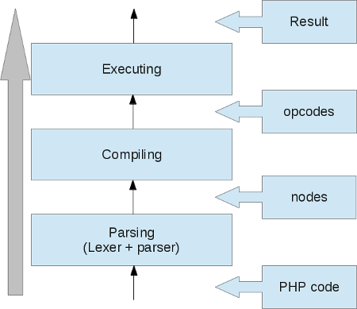
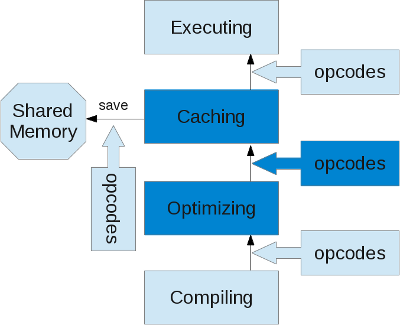
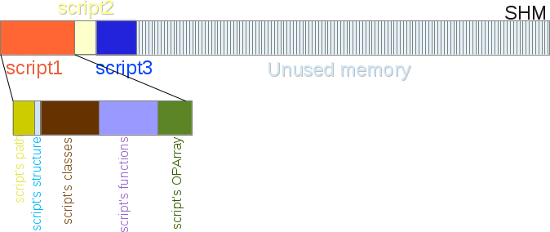
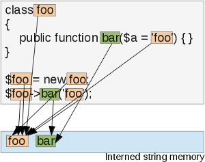
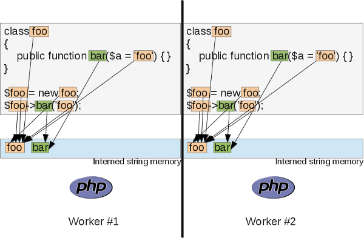
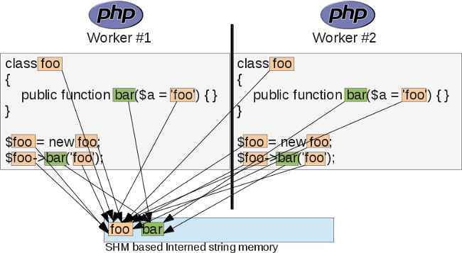
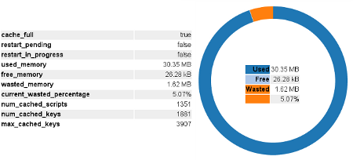
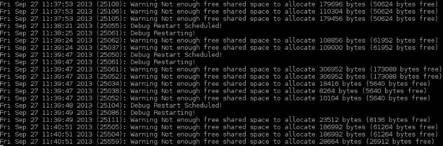
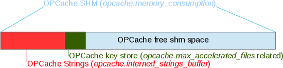
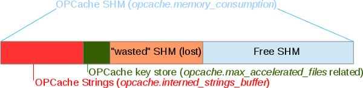

# OPcache Extension

## Reminder on OPCodes caches

PHP is a scripting language, that by default will compile any file you ask it to run, obtain OPCodes from a compilation, run them, and trash them away immediately. PHP has been designed like that: it "forgets" everything it's done in request R-1 when it comes to run request R.


This article originally from [blog.jpauli.tech](http://blog.jpauli.tech/2015-03-05-opcache-html/)


On production servers, the PHP code is very unlikely to change between several requests, thus, the compilation step will always read the same source code, leading to the very exact same OPCode to be run. This is a big waste of time and resources, as the PHP compiler is invoked for every request, for every script.



Knowing that compilation can really take a lot of time, OPCode cache extensions have been designed. Their main goal is to compile once and only once each PHP script, and cache the resulting OPCodes into shared memory so that every other PHP worker of your production worker pool (usually using PHP-FPM) can make use of the OPCodes by reading them and executing then back.

The result is a massive boost in the overall performance of the language, dividing time to run a script by a factor of at least 2 (very depend on the script), usually more than 2, as PHP now doesn't have to compile again and again the same PHP scripts.

The boost is higher as the application is more complex. If you take applications running tons of files, like framework based applications, or products like WordPress, you will experience a factor of 10-15 or so. This is because the PHP compiler is slow, and this is just a normal situation: a compiler is slow, whatever it is, because its work is to turn a syntax into another, trying to understand what you asked, and somehow to optimize the generated code for it to later run the fastest as possible; so yes, compiling a PHP script is really slow and eats a lot of memory.

## Introducing OPcache

OPcache has been open-sourced since 2013 and is bundled into PHP's source starting from PHP 5.5.0. It has thus become a standard for PHP OPcode cache solutions. There exist other solutions, such as XCache, APC, Eaccelerator and others.&#x20;

I will not talk about those other solutions, as I myself don't know them except APC. APC support has been discontinued in favour of OPcache. Short, if you were using APC before, please, use OPcache now.

OPcache has become the real official recommended OPCode cache solution by the developers of PHP. You may still use other solutions if you want, however, never ever activate more than one OPCode cache extension at the same time, you will likely crash PHP.

Be aware that new development involving OPcache won't target PHP 5 branch, but PHP 7 branch which is the nowadays stable branch. This article will target OPcache for PHP 5 and PHP 7, so that you may spot the differences (which are not that big).

So OPcache is an extension, a `zend_extension` more precisely, which is shipped into the PHP source code, starting from PHP 5.5.0 (Pecl for others), and that must be activated through the normal php.ini process of activating an extension. For distros, please refer to your distribution manual to know how PHP and OPcache have been bundled.

## **Two features into one product**

OPcache is an extension which provides two main features:

* OPCodes caching&#x20;
* OPCodes optimization

Because OPcache triggers the PHP compiler, to get OPCodes and cache them, it could use this step to optimize the OPCodes. Optimizations are basically about compiler optimizations and share many concepts of this computer science discipline. OPcache optimizer is a multi-pass compiler optimizer.



## OPcache in deep

Let's now see together how OPcache works internally. If you want to follow the code, you can fetch it from the PHP source code, here it is for PHP 7.0.

Unlike what you can think, OPCode caching is not a that hard concept to analyze and understand. You must have good knowledge on how the Zend Engine works and has been designed, then you should start spotting places where the job can be done.

## Shared memory models

As you know, there exist many shared memory models under different Operating Systems. Under modern Unixes, there exist several ways of sharing memory through processes, most commonly used are:

* System-V shm API
* POSIX API
* mmap API
* Unix socket API

OPcache is able to use the first three of them, as soon as your OS supports the layer. The `INI` setting [`opcache.preferred_memory_model`](https://www.php.net/manual/en/opcache.configuration.php#ini.opcache.preferred-memory-model) allows you to explicitly select the memory model you want.\
If you leave the parameter to a null value, OPcache will select the first model which works for your platform, iterating through its table:

```c
	static const zend_shared_memory_handler_entry handler_table[] = {
	#ifdef USE_MMAP
		{ "mmap", &zend_alloc_mmap_handlers },
	#endif
	#ifdef USE_SHM
		{ "shm", &zend_alloc_shm_handlers },
	#endif
	#ifdef USE_SHM_OPEN
		{ "posix", &zend_alloc_posix_handlers },
	#endif
	#ifdef ZEND_WIN32
		{ "win32", &zend_alloc_win32_handlers },
	#endif
		{ NULL, NULL}
	};
```

So by default, `mmap` should be used. It's a nice memory model, mature and robust. However, it is less informative to the sysadmin that System-V SHM model is, and its `ipcs` and `ipcrm` commands.

As soon as OPcache starts (as soon as PHP starts), OPcache will try a shared memory model and will allocate one big memory segment that it will then divide and manage on its side. However, it will never free this segment back, nor will it try to resize it.


OPcache allocates one segment of shared memory when PHP starts, once for all, and never frees it nor fragments it.


The size of the memory segment can be told using the [`opcache.memory_consumption`](https://www.php.net/manual/en/opcache.configuration.php#ini.opcache.memory-consumption) INI setting (Megabytes). Size it big, don't hesitate to give space. Never ever run out of shared memory space, if you do, you will lock your processes, we'll get back to that later.

Size the shared memory segment according to your needs, don't forget that a production server dedicated to PHP processes may bundle several dozens of Gigabytes of memory, just for PHP. Having a 1Gb shared memory segment (or more) is not uncommon, it will depend on your needs, but if you use a modern application stack, aka framework based, with lots of dependencies etc.., then use at least 1Gb of shared memory.

The shared memory segment will be used for several things in OPcache:

* Script's data structure caching, involving obviously OPCodes caching but not only.
* Shared interned strings buffer.
* Cached scripts HashTable.
* Global OPcache shared memory state.

So remember, the shared memory segment size will not only contain raw OPCodes but other things needed for OPcache internals. Measure on your side and size it accordingly.


## OPCodes caching

Here we go to detail how the caching mechanism works.

The overall idea is to copy into shared memory (shm) every pointer data that won't change from request to request, aka immutable things. And there are many of them.

After, once loading back the same script: restore every pointer data from shared memory to standard process memory, tied to the current request.

When the PHP compiler is working, it uses Zend Memory Manager (ZMM) to allocate every pointer. This kind of memory used is request bound as ZMM will automatically attempt to free those pointers as soon as the current request finishes. Also, those pointers are allocated from the current process' heap, that is this is some privately mapped memory and thus can't be shared with other PHP processes. Hence, OPcache's job is to browse every structure returned by the PHP compiler, and not leave one single pointer allocated onto this pool, but copy it into a shared memory allocated pool.

And here we talk about compile-time, whatever has been allocated by the compiler, is assumed to be immutable. Non-immutable data will be created at runtime by the Zend Virtual Machine, so it is safe to save everything that the Zend Compiler created, into shared memory.

Examples of such created things: functions and classes, those are functions' name pointers, functions' OPArray pointers, classes' constants, classes declared variable names and eventually their default content. There are really many things that are created in memory by the PHP compiler.

Such a memory model is used to prevent locks at maximum. We'll go back to locks in a later subject, but basically, OPcache does its job all at once, before runtime, so that during the runtime of the script, OPcache has nothing more to do; volatile data will be created on the classical process heap using ZMM, and immutable data would have been restored from shared memory.

So, OPcache hooks into the compiler and replaces the structure this latter should fill-in while compiling PHP scripts, by its own. It then makes the compiler fills a `persistent_script` structure, instead of it filling directly the Zend Engine tables and internal structures.

Here is a `persistent_script` structure:

```c
	typedef struct _zend_persistent_script {
		ulong          hash_value;
		char          *full_path;              /* full real path with resolved symlinks */
		unsigned int   full_path_len;
		zend_op_array  main_op_array;
		HashTable      function_table;
		HashTable      class_table;
		long           compiler_halt_offset;   /* position of __HALT_COMPILER or -1 */
		int            ping_auto_globals_mask; /* which autoglobals are used by the script */
		accel_time_t   timestamp;              /* the script modification time */
		zend_bool      corrupted;
	#if ZEND_EXTENSION_API_NO < PHP_5_3_X_API_NO
		zend_uint      early_binding;          /* the linked list of delayed declarations */
	#endif

		void          *mem;                    /* shared memory area used by script structures */
		size_t         size;                   /* size of used shared memory */

		/* All entries that shouldn't be counted in the ADLER32
		 * checksum must be declared in this struct
		 */
		struct zend_persistent_script_dynamic_members {
			time_t       last_used;
			ulong        hits;
			unsigned int memory_consumption;
			unsigned int checksum;
			time_t       revalidate;
		} dynamic_members;
	} zend_persistent_script;
```

And here is how OPcache replaces the compiler structure by the `persistent_script` ones, simple function pointers switch:

```c
	new_persistent_script = create_persistent_script();

	/* Save the original values for the op_array, function table and class table */
	orig_active_op_array = CG(active_op_array);
	orig_function_table = CG(function_table);
	orig_class_table = CG(class_table);
	orig_user_error_handler = EG(user_error_handler);

	/* Override them with ours */
	CG(function_table) = &ZCG(function_table);
	EG(class_table) = CG(class_table) = &new_persistent_script->class_table;
	EG(user_error_handler) = NULL;

	zend_try {
		orig_compiler_options = CG(compiler_options);
		/* Configure the compiler */
		CG(compiler_options) |= ZEND_COMPILE_HANDLE_OP_ARRAY;
		CG(compiler_options) |= ZEND_COMPILE_IGNORE_INTERNAL_CLASSES;
		CG(compiler_options) |= ZEND_COMPILE_DELAYED_BINDING;
		CG(compiler_options) |= ZEND_COMPILE_NO_CONSTANT_SUBSTITUTION;
		op_array = *op_array_p = accelerator_orig_compile_file(file_handle, type TSRMLS_CC); /* Trigger PHP compiler */
		CG(compiler_options) = orig_compiler_options;
	} zend_catch {
		op_array = NULL;
		do_bailout = 1;
		CG(compiler_options) = orig_compiler_options;
	} zend_end_try();

	/* Restore originals */
	CG(active_op_array) = orig_active_op_array;
	CG(function_table) = orig_function_table;
	EG(class_table) = CG(class_table) = orig_class_table;
	EG(user_error_handler) = orig_user_error_handler;
```

As we can see, the PHP compiler is fully isolated and disconnected from the tables it usually fills; it will now fill the `persistent_script` structures. Then OPcache will have to browse those structures, and replace request allocated pointers to shm ones. OPcache is interested in:

* The script functions.
* The script classes.
* The script main OPArray.
* The script path.
* The script structure itself.



The compiler is also told some options to disable some optimizations it does, like `ZEND_COMPILE_NO_CONSTANT_SUBSTITUTION` and `ZEND_COMPILE_DELAYED_BINDING`. That would add more work to OPcache. Remember that OPcache hooks into the Zend Engine, it is not a source code patch.

Now that we have a `persitent_script` structure, we must cache its information. Remember that the PHP Compiler has filled-in our structures, but it allocated the memory behind this using the Zend Memory Manager; this memory will be freed at the end of the current request. We then need to browse this memory and copy all of it into the shared memory segment, so that the information we just gathered will now persist through several requests and won't need to be recomputed every time.

The process is as follow:

* Take the PHP script to cache, and compute every variable data size (every pointer target).
* Reserve into already allocated shared memory one big block of this precise size.
* Iterate over the PHP script variable structures, and for each variable-data pointer target, copy it into the just-allocated shared memory block.
* Do the exact opposite for script loading, when this comes to play.

So OPcache is clever about shared memory, and will not fragment it by freeing it and compacting it.\
For every script, it computes the exact size this script needs to store information into shared memory and then copies the data into the segment.&#x20;

The memory is never freed nor given back to the OS by OPcache thus the memory is perfectly aligned and never fragmented. This gives a big boost in the performance of shared memory, as there is no linked-list or BTree to store and traverse when managing memory that can be freed (like malloc/free do).&#x20;

OPcache keeps storing things into the shared memory segment, and when the data become stale (because of script revalidation); it does not free the buffers but mark them as "wasted". When the max wasted percentage is reached, OPcache triggers a restart.&#x20;

This model is very different from the old APC extension, for example, and has the big advantage of providing the same performances as time runs, because the memory buffer from SHM is never managed (freed, compacted, etc...), memory management operations are truly technically stuff which brings nothing to functionalities, but performance penalty as they run.&#x20;

OPcache has been designed with highest possible performance in mind for the PHP environment runtime, not touching back the shared memory segment provides as well a very good rate of CPU caches hits (especially L1 and L2, as OPcache also aligns the memory pointers for them to better find a hit in an L1/L2 line).

Caching a script thus involves as a first step computing the exact size of its data. Here is the algorithm:

```c
	uint zend_accel_script_persist_calc(zend_persistent_script *new_persistent_script, char *key, unsigned int key_length TSRMLS_DC)
	{
		START_SIZE();

		ADD_SIZE(zend_hash_persist_calc(&new_persistent_script->function_table, (int (*)(void* TSRMLS_DC)) zend_persist_op_array_calc, sizeof(zend_op_array) TSRMLS_CC));
		ADD_SIZE(zend_accel_persist_class_table_calc(&new_persistent_script->class_table TSRMLS_CC));
		ADD_SIZE(zend_persist_op_array_calc(&new_persistent_script->main_op_array TSRMLS_CC));
		ADD_DUP_SIZE(key, key_length + 1);
		ADD_DUP_SIZE(new_persistent_script->full_path, new_persistent_script->full_path_len + 1);
		ADD_DUP_SIZE(new_persistent_script, sizeof(zend_persistent_script));

		RETURN_SIZE();
	}
```

I repeat, what we have to cache are:

* The script functions.
* The script classes.
* The script main OPArray.
* The script path.
* The script structure itself.

For functions, classes and OPArray, the iterating algorithm is deep searching; it caches every pointer data.\
For example for the functions in PHP 5, we must copy into shared memory (shm):

#### **The functions HashTable**

* The functions HashTable buckets table (Bucket \*\*)
* The functions HashTable buckets (Bucket \*)
* The functions HashTable buckets' key (char \*)
* The functions HashTable buckets' data pointer (void \*)
* The functions HashTable buckets' data (\*)

#### **The functions OPArray**

* The OPArray filename (char \*)
* The OPArray literals (names (char \*) and values (zval \*))
* The OPArray OPCodes (zend\_op \*)
* The OPArray function name (char \*)
* The OPArray arg\_infos (zend\_arg\_info \*, and the name and class name as both char \*)
* The OPArray break-continue array (zend\_brk\_cont\_element \*)
* The OPArray static variables (Full deep HashTable and zval \*)
* The OPArray doc comments (char \*)
* The OPArray try-catch array (zend\_try\_catch\_element \*)
* The OPArray compiled variables (zend\_compiled\_variable \*)

I did not detail all, and these changes for PHP 7 as the structures (such as the hashtable) are different.\
The idea is as I expressed it; copy in shared memory every pointer data. As deep copies may involve recursive structures, OPcache uses a translate table for pointer storage; every time it copies a pointer from regular request-bound memory to shared memory, it saves the association between the old pointer address and the new pointer address.

The copy process, before copying, looks up this translate table to know if it has already copied the data if so, it reuses the old pointer data so that it never duplicates any pointer data:

```c
	void *_zend_shared_memdup(void *source, size_t size, zend_bool free_source TSRMLS_DC)
	{
		void **old_p, *retval;

		if (zend_hash_index_find(&xlat_table, (ulong)source, (void **)&old_p) == SUCCESS) {
			/* we already duplicated this pointer */
			return *old_p;
		}
		retval = ZCG(mem);;
		ZCG(mem) = (void*)(((char*)ZCG(mem)) + ZEND_ALIGNED_SIZE(size));
		memcpy(retval, source, size);
		if (free_source) {
			interned_efree((char*)source);
		}
		zend_shared_alloc_register_xlat_entry(source, retval);
		return retval;
	}
```

`ZCG(mem)` represents the fixed-size shared memory segment and is filled-in as elements are added. It then has already been allocated, there is no need to allocate memory on each copy (which would have been less performant), but simply fill-in the memory, and move forward the pointer address border.

We detailed the script caching algorithm, which role is to take any request-bound heap memory pointer and data and duplicate it into shared memory, if not already copied.

The loading algorithm does the exact opposite: it gets the `persistent_script` back from shared memory and browse each of its dynamic structures to duplicate every shared pointer to a request-bound allocated pointer.

The script is then ready to be run by the Zend Engine Executor, as it now doesn't embed any shared pointer address (which would lead to massive bugs of one script modifying the structure of its brother). The Zend Engine is tricked (hooked by OPcache); it has seen nothing of the pointers replacement happening before the execution happens.

This process of copying from regular memory to shared memory (cache script), or the opposite (load script), is highly optimized, and even if it involves many memory copies or hash lookups, which are not really nice in term of performance, we are way faster than triggering the PHP compiler every time.

## Sharing interned strings

Interned strings are a nice memory optimisation that's been added to PHP 5.4. This may feel like some commonsense; every time PHP meets an immutable string (a char\*), it stores it into a special buffer and reuses the pointer for every occurrence of this same string next to come.

You may learn more about interned strings [from this article](http://blog.jpauli.tech/2015/09/18/php-string-management.html#interned-strings). Interned strings are about immutable strings, and thus are nearly exclusively used into the PHP compiler.

Interned strings work like this:



The same instance of a string is shared to every pointer. But there still is a problem with that; this interned string buffer is a per-process buffer, it is managed by the PHP compiler mainly. That means that in a PHP-FPM pool, every PHP worker will store its own copy of this buffer, something like this:



This leads to a massive waste of memory, especially in case you have tons of workers (you're likely to have), and you use very big strings in your PHP code (tip: PHP's annotation comments are strings). What OPcache takes care of, is sharing this buffer between every PHP worker of a pool. Something like this:



Et voila! OPcache shares the interned string buffers of all the PHP-FPM worker of the same pools and uses its shm segment to store those.

Thus, you need to size the shm segment according to your interned strings usage as well. Also, OPcache allows you to tune the interned strings shm usage using `opcache.interned_strings_buffer` INI setting. Monitor OPcache and once more; make sure you have enough memory.

However here, if you run out of interned strings memory space (`opcache.interned_strings_buffer`setting is too low), OPcache will not trigger a restart, because it still has some shm available, only interned strings buffer is full, which is not blocking to continue processing request, you'll simply end up having some strings interned and shared, and some other that use PHP worker's memory. I don't recommend that for performance.

Read your logs, when you run out of interned string memory, OPcache warns you:

```c
	if (ZCSG(interned_strings_top) + ZEND_MM_ALIGNED_SIZE(sizeof(Bucket) + nKeyLength) >=
			ZCSG(interned_strings_end)) {
			/* no memory, return the same non-interned string */
			zend_accel_error(ACCEL_LOG_WARNING, "Interned string buffer overflow");
			return arKey;
		}
```


Interned strings are about every piece of immutable string the PHP compiler is going to meet while doing its job; variable names, "php strings", function names, class names... PHP comments, nowadays used and called "annotations", are strings as well, and they are usually huge strings, that will eat most of your interned strings buffer. Think about them as well.


## The locking mechanism

As soon as we talk about shared memory (shm), we must talk about memory locking mechanisms.\
The baseline is simple; every PHP process that is willing to write into shared memory will lock every other process willing to write into shared memory as well. So the critical section is done on write operations, and not read operations.

You may happen to have 150 PHP processes reading the shared memory, only one of them may write into the shm at the same time, write operation doesn't prevent read operation but another write operation.

So, there should be no dead-lock in OPcache, until you don't prime your cache smoothly. If, after your code deployment, you open your webserver to traffic, then there will be a massive rush on your scripts to compile and cache them, and as the cache write-to-shm operation is done under exclusive lock, you will probably lock every process once the first lucky one has obtained a lock to write.

When this latter will release the lock, every process waiting for it will then see that the file they just compiled is already stored into shm and then they will trash the compilation result to load it from shm. This is a big waste of resources.

```c
	/* exclusive lock */
	zend_shared_alloc_lock(TSRMLS_C);
	
	/* Check if we still need to put the file into the cache (may be it was
	 * already stored by another process. This final check is done under
	 * exclusive lock) */
	bucket = zend_accel_hash_find_entry(&ZCSG(hash), new_persistent_script->full_path, new_persistent_script->full_path_len + 1);
	if (bucket) {
		zend_persistent_script *existing_persistent_script = (zend_persistent_script *)bucket->data;

		if (!existing_persistent_script->corrupted) {
			if (!ZCG(accel_directives).revalidate_path &&
			    (!ZCG(accel_directives).validate_timestamps ||
			     (new_persistent_script->timestamp == existing_persistent_script->timestamp))) {
				zend_accel_add_key(key, key_length, bucket TSRMLS_CC);
			}
			zend_shared_alloc_unlock(TSRMLS_C);
			return new_persistent_script;
		}
	}
```

What you should do, is cut off your server from external web traffic, deploy your new code, curl some of your most heavy URLs, so that your curl requests will smoothly prime the shm. When you think you are done with the big majority of your scripts, you may now open your webserver to traffic, so that now this one will massively read shm, which is a lock-free operation.

Sure there may still be some little scripts not compiled yet, but as soon as they are uncommon, there is no pressure on the write lock.

What you should avoid, is writing PHP files at runtime, and then make use of them. For the exact same reason; as soon as you write a new PHP file onto your production server documentroot, and you make use of it, chances are that it will be rushed by thousands of PHP workers trying to compile and cache it into shm; you will lock.

Those dynamically generated PHP files should be added to the OPcache blacklist, using the `opcache.blacklist-filename` INI setting (which accepts glob patterns).

Technically speaking, the lock mechanism is not very strong, but it works on many flavours of Unix; it uses the famous `fcntl()` call.

```c
	void zend_shared_alloc_lock(TSRMLS_D)
	{
		while (1) {
			if (fcntl(lock_file, F_SETLKW, &mem_write_lock) == -1) {
				if (errno == EINTR) {
					continue;
				}
				zend_accel_error(ACCEL_LOG_ERROR, "Cannot create lock - %s (%d)", strerror(errno), errno);
			}
			break;
		}
		ZCG(locked) = 1;
		zend_hash_init(&xlat_table, 100, NULL, NULL, 1);
	}
```

I here talked about memory locks happening on the normal process; nothing bad, if you take care, no more than one PHP process should be writing to the shm at the same time, so you won't suffer from any lock waiting times.

There exists however another lock that you should prevent from happening; the memory exhausted lock. This is the next chapter.

## Understanding the OPcache memory consumption

So I remind you with facts:

1. OPcache creates one unique segment of shared memory, once for all, at PHP startup (when you start PHP-FPM).
2. OPcache never frees some shm into this segment, the segment is allocated at startup, then filled in according to the needs.
3. OPcache locks shm when it writes into it.
4. shm is used for several purposes:&#x20;
   * Script's data-structure caching, involving obviously OPCodes caching but not only.
   * Shared interned strings buffer.
   * Cached scripts HashTable.
   * Global OPcache shared memory state.

If you use validation of your scripts, OPcache will check their modification date at every access (not every, check `opcache.revalidate_freq` INI setting), and will have a hint of whether the file is fresh or stale.

This check is cached; it is not costly as opposed to what you could think. OPcache comes into the scene sometime after PHP, and PHP has already `stat()`ed the file; OPcache just reuses this information and does not issue a costly `stat()` call to the filesystem again for its own use.

If you use timestamp validation, via `opcache.validate_timestamps` and `opcache.revalidate_freq`, and your file has effectively changed, then OPcache will simply invalidate it, and flag all of its shm data as invalid.

It will not free anything from shm. OPcache flags the shm parts as "wasted". Only when OPCache runs out of shm on an allocation AND when wasted memory reaches the `opcache.max_wasted_percentage` INI setting value, OPcache will trigger a full restart, which is something you must absolutely prevent from happening No other scenario.

```c
	/* Calculate the required memory size */
	memory_used = zend_accel_script_persist_calc(new_persistent_script, key, key_length TSRMLS_CC);

	/* Allocate shared memory */
	ZCG(mem) = zend_shared_alloc(memory_used);
	if (!ZCG(mem)) {
		zend_accel_schedule_restart_if_necessary(ACCEL_RESTART_OOM TSRMLS_CC);
		zend_shared_alloc_unlock(TSRMLS_C);
		return new_persistent_script;
	}
```


The picture above details what your shm segment could look like after some time has passed and some scripts have changed. The changed scripts' memory has been marked as "wasted", and OPcache will simply now ignore those memory areas, as well as it will recompile your changed scripts and create a new memory segment for their information's.

When enough wasted memory is reached, a restart will happen, OPcache will then lock shm, reset the shm segment (empty it entirely), and release the lock. This will let your server in a situation like if it has just started; every PHP worker is going to stress the lock now because every worker will try to compile some files; your web server will now suffer from very poor performance because of locks.

The more the load, the less performance, this is unfortunately the rule with locks. So your server may really suffer for long seconds now.


Never run out of shared memory


More generally, what you should do is disable script modification tracking on a production server, that way you are sure the cache will never trigger a restart (this is not entirely true as OPcache may still run out of persistent script keyspace, we'll see that later). A classic deployment should follow the rules:

* Take out the server from the load (disconnect it from your load balancer).
* Empty OPcache (call `opcache_reset()`) or directly shut down FPM (better, we'll detail in few minutes).
* Deploy a new version of your application at once.
* Restart your FPM pool if needed and prime your new cache smoothly by triggering curl request on major application entry points.
* Open back your server to traffic.

All this can be done with a 50 line shell script that can be turned very robust playing with `lsof` and `kill` in case some hard requests don't seem to finish. Bring your Unix knowledge ;-).

You can even see what happens using one of the numerous GUI frontends for OPcache available anywhere on the web and Github, they all make use of the `opcache_get_status()` function:



This is not the full story though, there is another thing to clearly keep in mind; **cache keys**.

When OPcache stores a cached script into SHM, it stores it's into a HashTable, to be able to find the script back after. But it has to choose a key to index the HashTable. What index/key does OPcache use to achieve this goal? This highly depends on both the configuration and the way your app has been designed.

Normally, OPcache resolves the full path to the script, but take care as it uses the PHP's realpath cache and you may suffer from it. If you change your documentroot using a symlink, put `opcache.revalidate_path` to 1 and empty your realpath cache (which may be hard to do as it is bound to the PHP worker process handling the current request).

So, OPcache resolves the path to the file, and when resolved, it uses the realpath string as a cache key for the script, and that's all, assuming you have `opcache.revalidate_path` INI setting turned to 1. If not, OPcache will also use the **unresolved path** as a cache key, and that will lead to problems if you were using symlinks, because if you then change the symlink target, OPcache will not notice it, as it will still use the unresolved path as key to find the old targetted script (this is to save a symlink resolution call).

By turning `opcache.use_cwd` to 1, you tell OPcache to prepend the `cwd` to every key, in case you use relative paths to include your files, like `require_once "./foo.php";`. I suggest, if you use relative paths and host several applications on the same PHP instance (which you shouldn't do), to always put `opcache.use_cwd `to 1. Also, if you happen to play with symlinks, turn _opcache.revalidate\_path_ to 1. But even with those settings on, you will suffer from PHP's realpath cache, and you may change the _www _symlink to another target, it won't be noticed by OPcache, even if you empty the cache by using `opcache_reset()`.


Because of PHP's realpath cache, you may experience problems if using symlinks to handle your documentroot for deployment. Turn _opcache.use\_cwd_ and _opcache.revalidate\_path_ to 1, but even with those settings, bad symlink resolutions may happen, this is because PHP answers OPcache realpath resolution requests with a wrong answer, coming from its realpath\_cache mechanism.


If you want to be extra safe in your deployment, the first option is to not use symlinks to manage your documentroot.

If not, then use a double FPM pool, and use a FastCGI load balancer to balance between the two pools when deploying. Lighttpd and Nginx have this feature enabled by default as far as I remember:

* Take out the server from the load (disconnect it from your load balancer).
* Shut down FPM, you will kill PHP (and then OPcache) and will be extra safe especially about PHP's realpath cache, which may trick you. This latter will be cleared if you shut down FPM. Monitor the eventual workers that may be stuck, and kill them if necessary.
* Deploy a new version of your application at once.
* Restart your FPM pool. Don't forget to prime your new cache smoothly by triggering curl requests on major application entry points before.
* Open back your server to traffic.

If you don't want to take your server out of the balancer, what can be done then, is:

* Deploy your new code into another directory, as your PHP server has one FPM pool still active and serving production requests.
* Start another FPM pool, listening on another port, while still having the first FPM pool active and serving production requests.
* Now you have two FPM pools, one hot and working, one idle, waiting to be bound to requests.
* Change your documentroot symlink target to target the new deploy path, and immediately after, stop the first FPM pool. If you told your webserver about your two pools, it should notice the first pool is dying, and should load balance traffic to the new pool now, with no traffic interruption nor failing requests. The second pool will then be triggered, will resolve the new docroot symlink (as it is fresh and has a cleared realpath cache), and serve your new content. This clearly works, I used that on production servers many times, a \~80 lines well-written shell script can take care of all this job.

So depending on the settings, one unique script may lead to several keys computed by OPcache. But the key store is not infinite; it is also allocated into shared memory and may get full, in which case even if there is still a lot of room into the shm, because the persistent script hashtable is full, OPcache will behave like if it had no more memory, and will trigger a restart for next requests.


You always should monitor the number of keys in the key store, for it never to be full.


OPcache gives you this information with the use of `opcache_get_status()`, a function the different GUIs rely on. The `num_cached_keys` dimension returned by this function gives the info. You should preconfigure the number of keys, as a hint, using `opcache.max_accelerated_files` INI setting.

Take care as the name suggests a number of files, in fact, it is the number of keys that OPcache will compute, and as we've seen, one file may lead to several keys being computed. Monitor it, and use the right number. Avoid using relative paths in `require_once` statements, it makes OPcache generate more keys. Using an autoloader is recommended, as this one, if well configured, will always issue `include_once` calls with full paths, and not relative ones.


OPcache preallocates the HashTable to store future persistent scripts when it starts (when PHP starts), and never tries to resize it. If it gets full, it will then trigger a restart. This is done for performance reasons.


So this is why you may see a `num_cached_scripts` a dimension which is different from the `num_cached_keys` dimension, from OPcache status report. Only the `num_cached_keys` info is relevant if it reaches `max_cached_keys,` you'll be in trouble with a restart pending.

Do not forget that you can understand what happens by lowering OPcache's log level (`opcache.log_verbosity_level `INI). It tells you if it runs out of memory, and which kind of OOM (OutOfMemory) error it generated; if it is related to the shm being full, or if it is the keys Hashtable which is full.



```c
	static void zend_accel_add_key(char *key, unsigned int key_length, zend_accel_hash_entry *bucket TSRMLS_DC)
	{
		if (!zend_accel_hash_find(&ZCSG(hash), key, key_length + 1)) {
			if (zend_accel_hash_is_full(&ZCSG(hash))) {
				zend_accel_error(ACCEL_LOG_DEBUG, "No more entries in hash table!");
				ZSMMG(memory_exhausted) = 1;
				zend_accel_schedule_restart_if_necessary(ACCEL_RESTART_HASH TSRMLS_CC);
			} else {
				char *new_key = zend_shared_alloc(key_length + 1);
				if (new_key) {
					memcpy(new_key, key, key_length + 1);
					if (zend_accel_hash_update(&ZCSG(hash), new_key, key_length + 1, 1, bucket)) {
						zend_accel_error(ACCEL_LOG_INFO, "Added key '%s'", new_key);
					}
				} else {
					zend_accel_schedule_restart_if_necessary(ACCEL_RESTART_OOM TSRMLS_CC);
				}
			}
		}
	}
```

So, to conclude about memory usage, here is the picture:



When you start PHP, you start OPcache, it allocates immediately `opcache.memory_consumption `Megabytes of shared memory (shm) from the OS.

It then starts using this space, and stores into it the interned strings buffer (`opcache.interned_strings_buffer`). After that, it preallocates the HashTable for future persistent scripts and their keys to be stored. The space used depends on the `opcache.max_accelerated_files`.

Now, a part of the shm is used by OPcache internals, and the non-occupied space left is dedicated to you; to your scripts data structures. This (actually free) memory segment will then be filled in, and as your scripts will change and OPcache will recompile them (assuming you told it to), the space will slowly become "wasted"; except if you tell OPcache not to recompile changed scripts (recommended).

That may look like something like this:



If persistent scripts HashTable becomes full, or if free SHM runs out, OPcache will trigger a restart (which you'd want to prevent absolutely).

## Configuring OPcache

If you use a framework based application, like a Symfony based application, I strongly suggest:

* Turn off revalidation mechanism on production (turn `opcache.validate_timestamps `to 0).
* Deploy using a full new runtime of your scripts, this is the case with Symfony applications.
* Size correctly your buffers:
  1. `opcache.memory_consumption`, the most important.
  2. `opcache.interned_strings_buffer` , monitor your usage, and size accordingly, take care if you tell OPcache to save comments, which you will likely do if you use PHP "annotations" .(`opcache.save_comments`_ = 1_), those are strings, big strings, that will eat your interned strings buffer
  3. `opcache.max_accelerated_files `, numbers of keys to preallocate, once more: monitor and size accordingly.
* Turn off `opcache.opcache.revalidate_path` and `opcache.use_cwd`. That will save some keyspace.
* Turn on `opcache.enable_file_override `, this will accelerate the autoloader.
* Fill-in `opcache.blacklist_filename` list with the script names you are likely to generate during runtime; shouldn't be too many of them anyway.
* Turn off `opcache.consistency_checks`, this basically checks a control sum on your scripts, that eats perf.

With those settings, your memory should never get wasted, then `opcache.max_wasted_percentage` is not very useful in this case.

With those settings, you'll need to turn off your main FPM instance when deploying. You may play with several FPM pools to prevent service downtime like explained earlier. That should be enough.


