# OPcache Optimisations

## **Introducing**

So we talked about caching OPCodes into shm and loading them back later. Just before caching them, OPcache may also run optimizer passes.


This article originally from [blog.jpauli.tech](http://blog.jpauli.tech/2015-03-05-opcache-html/)


To fully understand the optimizer, you have to have a good knowledge of how the Zend VM Executor works. Also, you may bring your compiler knowledge, if you are very new to such concepts, perhaps starting [reading some articles on the subject](https://msdn.microsoft.com/en-us/magazine/dn904673.aspx) may help?. Or at least the mandatory-reading [Dragon Book](http://en.wikipedia.org/wiki/Compilers:_Principles,_Techniques,_and_Tools)? Anyway, I'll try to make the subject understandable and fun to read.

Basically, the optimizer is given the whole OPArray structure, and may now browse it, find flaws, and fix them. But as we are analyzing OPCodes **at compile-time**, we have no clue at all on everything tied to a "PHP variable". Basically, we don't know yet what will be stored in any `IS_VAR` or `IS_CV` operand, but only in `IS_CONST` or sometimes in `IS_TMP_VAR`.

Like in any compiler for every language; we must create the most optimized structure to be run at runtime so that the runtime will be the fastest as possible.

OPcache optimizer can optimize a lot of things in `IS_CONST`; We can also replace some OPCodes by others \(more optimized at runtime\), we also find and trash dead code branches by using a CFG \(control flow graph\) analysis, but we don't unroll loops, or process to loop invariant motions as such optimizations are hard to apply to PHP.

We also have other possibilities related to PHP internals; we may change the way classes are bound to optimize a bit the process in some specific cases, but we have absolutely not the possibility to do some cross file optimizations, because OPcache plays with OPArrays coming from file compilation \(among other functions' OPArrays\), and there is total isolation of those OPArrays.

PHP has never been built on a cross file-based VM; the Virtual Machine and the language is file bound; when compiling a file, we have absolutely no information about the files that already got compiled, and those to come next.

We then must try to optimize on a file-by-file basis, and must not assume for example that class A will be present in the future if it is not at the moment. This is very different from Java or C++ that compile using compilation units and allowing cross-file optimizations; PHP simply won't do that, it's not been designed like that.


The PHP compiler acts on a file basis and has no shared state through file compilations, it doesn't compile a project in its whole, but a file, followed by others. There is no room for cross file optimizations.


OPcache optimization passes can be enabled on a case-by-case basis, using the INI setting `opcache.optimization_level`. It should represent a mask for optimizations you'd like to see enabled, based on their binary values:

```c
	/* zend_optimizer.h */
	#define ZEND_OPTIMIZER_PASS_1		(1<<0)   /* CSE, STRING construction     */
	#define ZEND_OPTIMIZER_PASS_2		(1<<1)   /* Constant conversion and jumps */
	#define ZEND_OPTIMIZER_PASS_3		(1<<2)   /* ++, +=, series of jumps      */
	#define ZEND_OPTIMIZER_PASS_4		(1<<3)   /* INIT_FCALL_BY_NAME -> DO_FCALL */
	#define ZEND_OPTIMIZER_PASS_5		(1<<4)   /* CFG based optimization       */
	#define ZEND_OPTIMIZER_PASS_6		(1<<5)
	#define ZEND_OPTIMIZER_PASS_7		(1<<6)
	#define ZEND_OPTIMIZER_PASS_8		(1<<7)   
	#define ZEND_OPTIMIZER_PASS_9		(1<<8)   /* TMP VAR usage                */
	#define ZEND_OPTIMIZER_PASS_10		(1<<9)   /* NOP removal                 */
	#define ZEND_OPTIMIZER_PASS_11		(1<<10)  /* Merge equal constants       */
	#define ZEND_OPTIMIZER_PASS_12		(1<<11)  /* Adjust used stack           */
	#define ZEND_OPTIMIZER_PASS_13		(1<<12)
	#define ZEND_OPTIMIZER_PASS_14		(1<<13)
	#define ZEND_OPTIMIZER_PASS_15		(1<<14)  /* Collect constants */

	#define ZEND_OPTIMIZER_ALL_PASSES	0xFFFFFFFF

	#define DEFAULT_OPTIMIZATION_LEVEL  "0xFFFFBFFF"
```

## **Known constant statements and branch trashing**

Note that many compile-time known constant statements are NOT computed by the compiler but by OPCache, for PHP 5. In PHP 7, those are computed in the compiler.

Here we go with examples:

```php
	if (false) {
		echo "foo";
	} else {
	   echo "bar";
	}
```

This leads in classical compilation to:

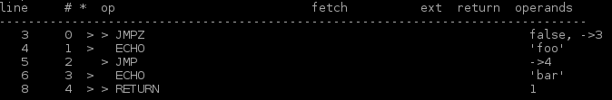

And optimized compilation:

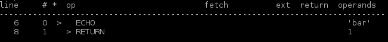

As we can see, the dead code in the `if(false)` branch has been trashed, the Zend VM executor will then simply have to run a `ZEND_ECHO` OPcode. We then saved some memory, because we threw away some OPCodes, and we may save a little bit of CPU cycles at runtime as well.

I recall you that we cannot know the content of any variable yet, as we are still at compile time \(we are between compilation and execution\). A code with an `IS_CV` operand instead of `IS_CONST`, could not have been optimized:

```php
	/* That cant be optimized, what's in $a ? */
	if ($a) {
		echo "foo";
	} else {
	   echo "bar";
	}
```

Let's take another example so that you see the differences between PHP 5 and PHP 7:

```php
	if (__DIR__ == '/tmp') {
		echo "foo";
	} else {
	   echo "bar";
	}
```

In PHP 7, the constant `__DIR__` will be substituted and the equality check will be performed by the PHP 7 compiler, that is without OPcache. However, the branch analysis and the branch dead code removing is still done by an OPcache optimizer pass.

In PHP 5 however, the constant `__DIR__` is still substituted, but the equality check is not performed by PHP 5 compiler. This latter is performed by OPcache.

So here to sum up things, if you run both PHP 5 and PHP 7 with OPcache optimizer activated, you will end up to the exact same optimized OPCodes. But if you don't run OPcache optimizer, then the PHP 5 compiled code will be less efficient than the equivalent PHP 7 one, because the PHP 5 compiler doesn't perform any evaluation, whereas PHP 7 compiler computes a lot of things by itself \(without the need of OPcache optimizer that would come later\).

## **Constant functions pre-evaluation**

However, OP**c**ache is able to turn some `IS_TMP_VAR` to `IS_CONST`. That is, OPcache can compute itself at compile-time, some known values.

Some functions can be run at compile-time because their result will be constant. This is the case of several of them:

\* `function_exists()` and `is_callable()`, for internal functions only.  
\* `extension_loaded()`, if `dl()` is disabled in userland.  
\* `defined()` and `constant()` for internal constants only.  
\* `dirname()` if the argument is constant.  
\* `strlen()` and `dirname()` with constant argument \(PHP 7 only\).

So look at that example:

```php
	if (function_exists('array_merge')) {
		echo 'yes';
	}
```

Here, if the optimizer is disabled, the compiler generates many work to do for the runtime:

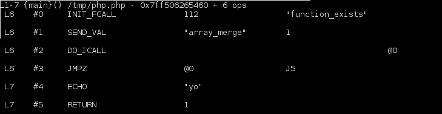

Optimized as:

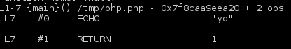

Notice that those functions don't compute userland-based. For example:

```php
if ( function_exists('my_custom_function') ) { }
```

Is not optimized, because you are very likely to have \(or not\) defined the `my_custom_function` is another file. And remember, the PHP compiler and OPcache optimizer only works on a file basis. Even if you do this:

```php
function my_custom_function() { }
if ( function_exists('my_custom_function') ) { }
```

That will not be optimized, because this is too unlikely to happen, the function call optimizer only works for internal types \(internal functions, internal constants\).

Another example with `dirname()` \(PHP 7 only\):

```php
	if (dirname(__FILE__) == '/tmp') {
		echo 'yo';
	}
```

Not optimized:

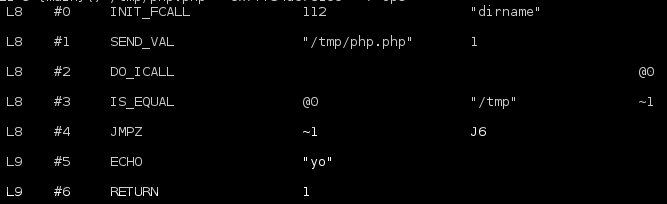

Optimized:


Again, `strlen()` is optimized in PHP 7. If we chain them together, we obviously meet a nice optimization. Like this:

```php
	if (strlen(dirname(__FILE__)) == 4) {
		echo "yes";
	} else {
		echo "no";
	}
```

Not optimized:

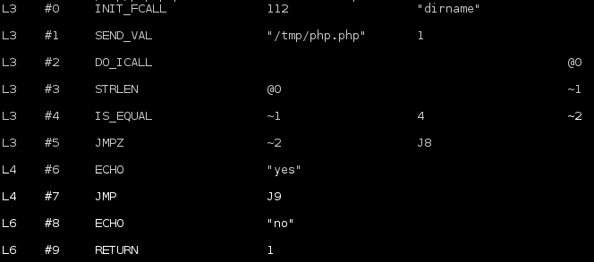

Optimized:

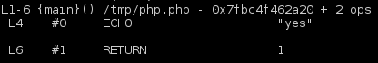

For the example above, you can notice that every statement has been computed at compile/optimization time, and then OPcache optimizer trashed all the 'false' branch \(assuming obviously that the 'true' part was chosen\).

## **Transtyping**

OPCache optimizer may switch your `IS_CONST` operand types, when it knows runtime will have to transtype them. That effectively saves some CPU cycles at runtime:

```php
	$a = 8;
	$c = $a + "42";
	echo $c;
```

Classical compilation:

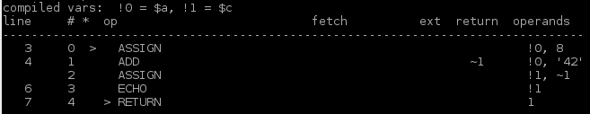

Optimized compilation:

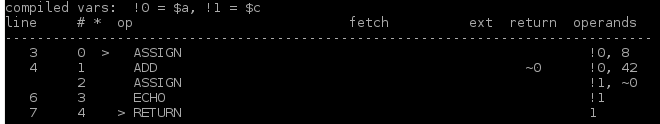

Look at the second operand true type of `ZEND_ADD` operation; it has switched from a string to an `int`. The optimizer did the job of transtyping the argument type for the math add operation. If it had not; the runtime VM would have done it again, and again, and again as the code is run again, and again, and again. This saves some CPU cycles involved in the transtyping operation.

Here is the OPcache optimizer code that does such a job:

```c
	if (ZEND_OPTIMIZER_PASS_2 & OPTIMIZATION_LEVEL) {
		zend_op *opline;
		zend_op *end = op_array->opcodes + op_array->last;

		opline = op_array->opcodes;
		while (opline < end) {
			switch (opline->opcode) {
				case ZEND_ADD:
				case ZEND_SUB:
				case ZEND_MUL:
				case ZEND_DIV:
					if (ZEND_OP1_TYPE(opline) == IS_CONST) {
						if (ZEND_OP1_LITERAL(opline).type == IS_STRING) {
							convert_scalar_to_number(&ZEND_OP1_LITERAL(opline) TSRMLS_CC);
						}
					}
					/* break missing *intentionally* - the assign_op's may only optimize op2 */
				case ZEND_ASSIGN_ADD:
				case ZEND_ASSIGN_SUB:
				case ZEND_ASSIGN_MUL:
				case ZEND_ASSIGN_DIV:
					if (opline->extended_value != 0) {
						/* object tristate op - don't attempt to optimize it! */
						break;
					}
					if (ZEND_OP2_TYPE(opline) == IS_CONST) {
						if (ZEND_OP2_LITERAL(opline).type == IS_STRING) {
							convert_scalar_to_number(&ZEND_OP2_LITERAL(opline) TSRMLS_CC);
						}
					}
					break;
		/* ... ... */
```

You should note however, that such optimization has been merged into the PHP 7 compiler. That means that even with OPcache disabled \(or optimizations disabled\), PHP 7 compiler already performs such an optimization, as well as many more that were not performed by the PHP 5 compiler.

A little bit more silly, but adding two `IS_CONST` expressions, the result can then be computed at compile-time, something the PHP compiler does not do by default in PHP 5, OPcache optimizer is needed:

```php
	$a = 4 + "33";
	echo $a;
```

Classical compilation:

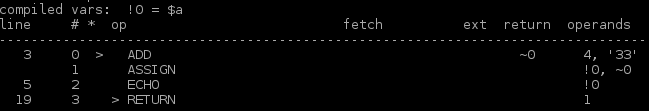

Optimized compilation:

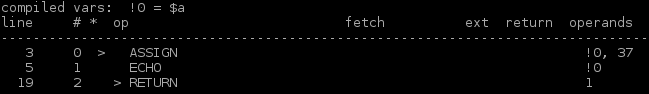

The optimizer computed the maths for `4 + 33`, and erased the `ZEND_ADD` operation to be run by replacing it directly by the result. This saves again some CPU at runtime, as the VM executor now has less job to do. Here again, this is done in PHP 7 by the compiler, whereas in PHP 5 you would need OPcache optimizer to do that.

## **Optimized OPCodes substitution**

Now let's dive deeper into OPCodes. Sometimes \(rarely\), it is possible to substitute a following of OPCodes by other ones, more optimized. Look at that:

```php
	$i = "foo";
	$i = $i + 42;
	echo $i;
```

Classical compilation:

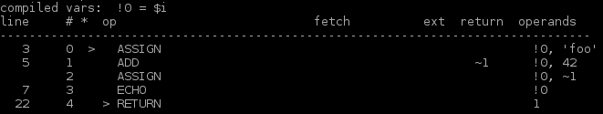

Optimized compilation:

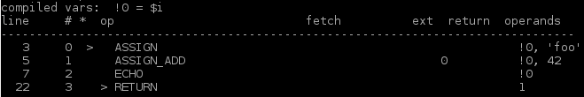

Here, our knowledge of the Zend VM executor leads us to substitute a `ZEND_ADD` plus a `ZEND_ASSIGN`, into a `ZEND_ASSIGN_ADD`, usually involved in statements such as `$i+=3;`  
`ZEND_ASSIGN_ADD` is more optimized, it is one OPCode instead of two \(which usually is better, but not every time\)**.**

On the same subject:

```php
	$j = 4;
	$j++;
	echo $j;
```

Classical compilation:

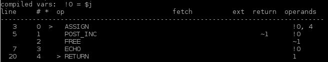

Optimized compilation:

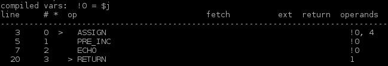

Here, OPcache optimizer replaced the `$i++` by a `++$i` statement, because it had the same meaning in this piece of code. `ZEND_POST_INC` is not very nice OPCode, because it must read the value, return it as-is, but increment a temporary value in memory, whereas `ZEND_PRE_INC` plays with the value itself, and reads it, increments it and returns it \(this is just the PRE vs POST incrementation difference\).

Because the intermediate value returned by `ZEND_POST_INC` is not used in the script above, the compiler must issue a `ZEND_FREE` OPCode, to free it from memory. OPcache optimizer turns the structure into a `ZEND_PRE_INC`, and removes the useless `ZEND_FREE` ; less job to figure out at runtime.

## **Constant substitution and precomputing**

What about PHP constants? They are more complex than what you think \(much more in fact\). So some optimizations that may seem obvious actually don't happen for many reasons, but let's see the actual ones:

```php
	const FOO = "bar";
	echo FOO;
```

Classical compilation:

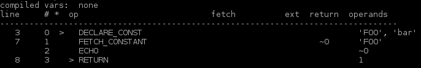

Optimized compilation:

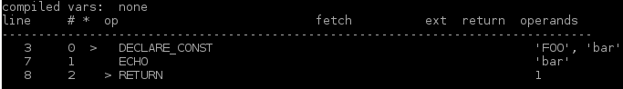

This is part of temporary variables optimizations, as we can see, here, once again, one OPCode has been trashed, the result of constant reading is directly figured out at compile time, into the optimizer, and the runtime will have less work to do.

Also, that ugly `define()` function can be replaced by a `const` statement, if its argument is constant:

```php
	define('FOO', 'bar');
	echo FOO;
```

The non-optimized OPCodes from this little script are horrible in term of performance:

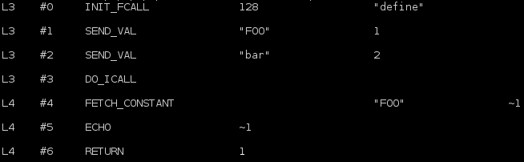

Optimized, is as expected:


`define()` is ugly, because it declares a constant but runs such a job at runtime, issuing a function call \(`define()` is really a function\). This is very bad.

The `const` keyword leads to a `DECLARE_CONST` OPCode. Note that in PHP 7, `define()` may lead to a const construct into the compiler directly \(no optimizer needed\).

## **Multiple jump target resolution**

This is actually a little bit hard to detail, but as usual with a simple example, you'll understand. ****This optimization is about jump targets in jump opcodes \(there are several flavours of them\). 

Every time the VM must jump, a jump address is computed by the compiler and stored into the VM operand. A jump is the result of a decision when the VM meets a decision point.

There are lots of jumps into PHP scripts. `if`, `switch`, `while`, `try`, `foreach`, `?:` ... are PHP statements making a decision, if the decision is true: jump to branch A, if not, jump to branch B.

Such algorithms can be optimized if the jump target is itself a jump. The landing jump will then make the VM jump again, to a final landing jump. Multiple jump target resolution is about directly making the VM jump to the final target.

Something like that:

```php
	if ($a) {
		goto a;
	} else {
		echo "no";
	}

	a:
	echo "a";
```

With classical compilation, we end up with such OPCodes:

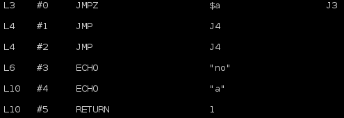

Translated \(just read it\) as: "if the result of $a evaluation is zero, jump to target 3, in target 3 echo "no". If not, continue, and meet a jump to 4. In 4, echo "a".

This is something like "Jump to 3, and in 3, jump to 4". Why not "jump to 4" directly then?. This is what the optimization does:


Here, we can translate that by "if $a evaluation is not zero, jump to 2 which echoes "a", if not, echo "no", much simpler isn't it?.

This optimization shows true power in case of very complex scripts with many levels of decisions. Like having a `while` into an `if`, in which a `goto` is performed, leading to a `switch` which performs `try-catches` , etc...

Without this optimization, the overall OPArray may contain tons of OPCodes. Those will mainly be jumps, but probably jumps leading to jumps. Activating this optimization can sometimes \(depend on the script\) reduce significantly the number of OPCodes and ease the path the VM will branch; leading in little gain of performances at runtime.

## **Concluding**

I did not show you all the work done by the optimizer. It can also optimize embedded loops by issuing "early returns" for example. Same for embed try-catch blocks or switch-breaks. PHP function calls, which is a heavy process into the engine, is also optimized when possible.


The main difficulty in optimizer passes, is to never change the meaning of the script, and especially its control flow.


The main difficulty in optimizer passes, is to never change the meaning of the script, and especially its control flow. Bugs were found about this some time ago in OPcache, and it is all but cool when you come to see that PHP executor doesn't behave the way it should, having your little PHP script written under your eyes. In fact, the OPCodes generated have been altered by the optimizer and the engine just runs something which is wrong. Not cool.

Nowadays, OPcache optimizer is pretty stable but still under development for next PHP versions. It had to be patched in deep for PHP 7 as that latter changed many things in internal structures design, as well as having a PHP 7 compiler doing much more optimization job \(the most trivial however\) than PHP 5 used to do \(PHP 5 compiler really does not optimize anything\).


The PHP 7 compiler is much more efficient than PHP 5's. A lot of optimizations before performed in PHP 5 OPcache are now embedded directly into PHP 7's heart.


#### End

We've seen that OPcache has finally become the standard recommended PHP OPCode caching solution. We detailed how it works, not that hard to understand, but error-prone yet.

Nowadays, OPcache is very mature/stable and achieves its goal of boosting dramatically the overall performance of the PHP language by both cancelling the time needed to compile a script and by optimizing the OPCodes resulting of the compilation.

Shared memory is used for every process of a PHP pool to be able to access structures that have been added by others. Interned strings buffer is also managed in shared memory, leading to even more memory savings in a PHP pool of workers - typically using PHP-FPM SAPI.


